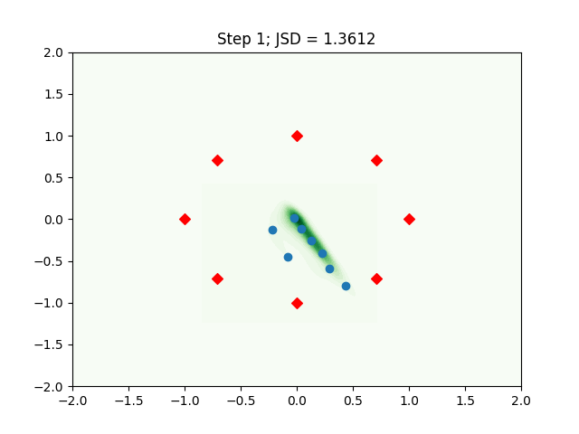
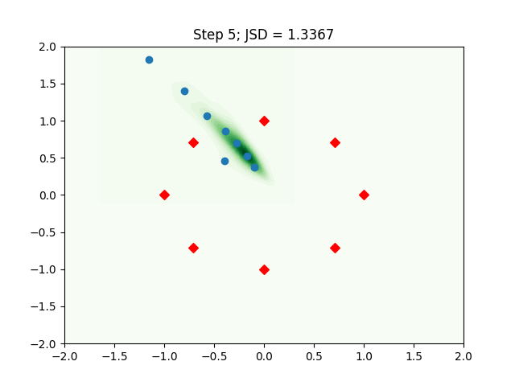
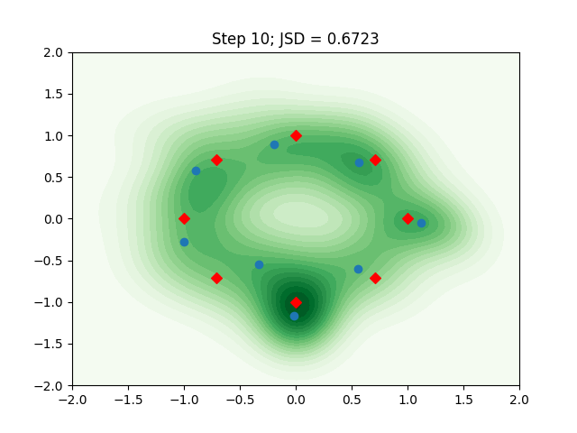
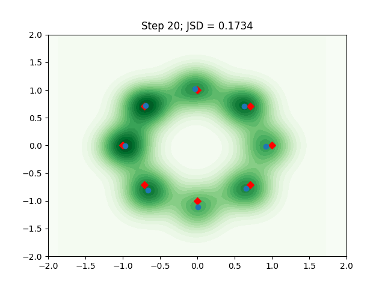
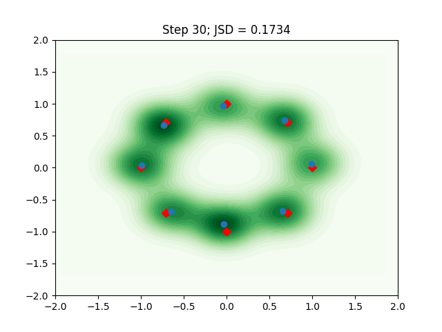

# Vanilla GAN on 2D mixture of Gaussians
## Run code
``` bash
git clone https://github.com/leox1v/GAN
cd GAN/vanilla_2d_gan/
python3 main.py # oprional add flags e.g. --batch_size=32 --max_iter=20
```

## Results
In the following we see the results for an artificial 2 dimensional data set generated from a mixture of gaussians with 8 modes. The step number corresponds to the number of iterations of the generator in thousands. The red points represent the mean values of the mixture components of the true distribution. The blue points are the clustering centroids of the generated samples. We see that with increasing number of steps the centroids converge to the true distribution means. The JSD value is the [Jensen Shannon Divergence](https://en.wikipedia.org/wiki/Jensen%E2%80%93Shannon_divergence) between the true and the generated distribution.





